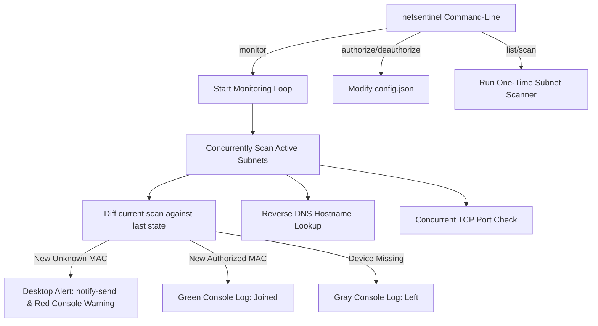

# 🛡️ LAN Sentinel

**LAN Sentinel** is a fast, concurrent command-line network security monitor and intruder alert utility written in **Go**.

It scans local Wi-Fi subnets using high-concurrency worker goroutines to discover active hosts. Discovered devices are matched against a persistent local database (`config.json`) of authorized MAC addresses. If an unrecognized device connects to your Wi-Fi, LAN Sentinel raises red flags in the console and triggers instant desktop notifications on your system.

---

## 🌟 Key Features

*   ⚡ **High-Concurrency Scanning:** Spawns a pool of up to 64 concurrent goroutines, performing network discovery (ARP, ICMP ping sweeps, and TCP port checks) in under 3 seconds.
*   🛡️ **Intrusion Alerts:** Detects and reports newly joined unauthorized MAC addresses immediately.
*   🔔 **OS Desktop Notifications:** Integrated with Linux desktop notification daemons (`notify-send`) to push instant warning bubbles.
*   🔍 **Service Fingerprinting:** Audits and lists common active servers (such as SSH, HTTP, HTTPS, SMB, and dev servers) running on network nodes.
*   💾 **Persistent Device Registry:** Simple file-based configuration (`config.json`) maps device MAC addresses to friendly aliases (e.g., `"Workstation"`).
*   🏠 **Local Interface Resolution:** Auto-resolves the host machine's interface MAC addresses to distinguish your own machine from external network traffic.

---

## 🛠️ Prerequisites

*   **Go Compiler:** Go 1.20+ (Build/Development only)
*   **Operating System:** Linux (Arch Linux, Ubuntu, Fedora, Debian, etc.)
*   **Alert Tool:** `libnotify` (provides `notify-send` for desktop popups)

---

## 🚀 Getting Started

### 1. Compile the Binary
Clone or navigate to the directory and compile the Go project into a standalone executable:
```bash
cd /path/to/netscan
go build -o netsentinel ./cmd/netsentinel
```

### 2. General Usage Syntax
```bash
./netsentinel <command> [arguments]
```

---

## 📖 CLI Commands Guide

| Command | Arguments | Description |
| :--- | :--- | :--- |
| `help` | None | Displays help information and CLI flags. |
| `scan` | None | Performs a fast, one-time network scan. |
| `list` | None | Lists your authorized registry and displays current online devices. |
| `monitor` | None | Launches the background loop to continually monitor connection changes. |
| `authorize` | `<MAC> <alias>` | Registers a device MAC address with a friendly identifier. |
| `deauthorize`| `<MAC>` | Removes a registered MAC address from the whitelist. |
| `settings` | `interval <sec>` | Adjusts scan frequency (Default: `30` seconds). |
| `settings` | `notify <t/f>` | Toggles desktop notifications (`true` or `false`). |

### Examples

*   **Authorize your local gateway (router) and workstation:**
    ```bash
    ./netsentinel authorize 00:11:22:33:44:55 "Home Gateway"
    ./netsentinel authorize aa:bb:cc:dd:ee:ff "My Workstation"
    ```

*   **View your whitelisted devices and scan who is currently online:**
    ```bash
    ./netsentinel list
    ```

*   **Run the security monitor daemon:**
    ```bash
    ./netsentinel monitor
    ```

---

## ⚙️ Configuration (`config.json`)

On its first run, LAN Sentinel creates a configuration file (`config.json`) in the binary directory:

```json
{
  "scan_interval_seconds": 30,
  "enable_notifications": true,
  "authorized_devices": {
    "00:11:22:33:44:55": "Home Gateway",
    "aa:bb:cc:dd:ee:ff": "My Workstation"
  }
}
```

---

## 🏗️ Design & Architecture



1.  **Scanner (`scanner.go`):** Uses `net.Interfaces` to discover your subnets. It generates all host IPs in the range and divides the scan among 64 goroutines. It runs `ping -c 1` and parses `/proc/net/arp` to identify active hosts (including those bypassing ICMP pings).
2.  **Monitor (`monitor.go`):** Tracks the network state in-memory. If a MAC address appears that is not in `config.json`, it triggers desktop popup alerts using Arch Linux system notification calls.
3.  **Config (`config.go`):** Thread-safe JSON serialization utilizing file-level locking (`sync.RWMutex`).
